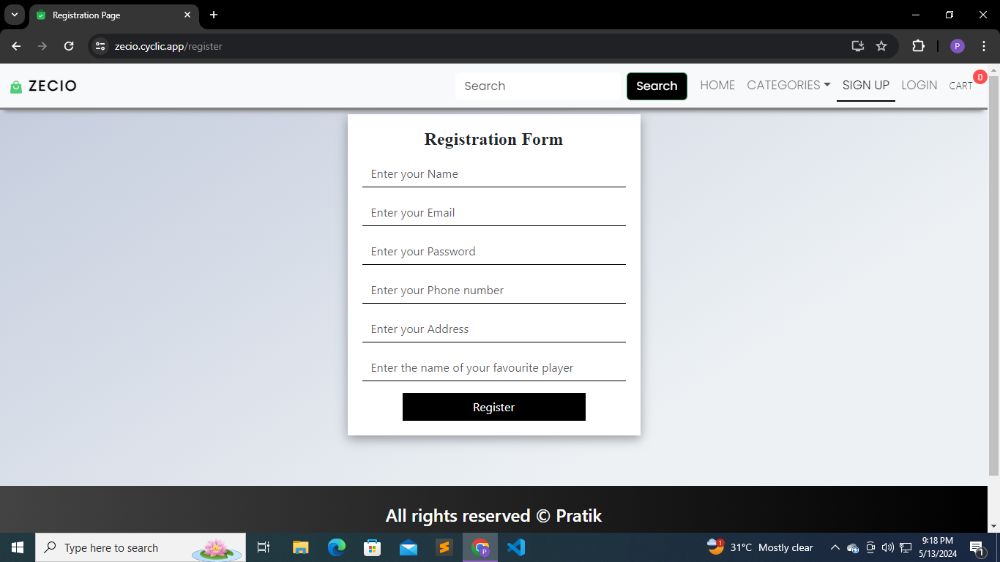

# ZECIO - Your Ultimate Store

## Overview

Welcome to ZECIO, your ultimate destination for all your online shopping needs! ZECIO is a feature-rich e-commerce platform built with cutting-edge technologies to provide you with a seamless and secure shopping experience.

## Experience the Zecio App live! Visit the application at:

[Live Zecio App](https://zecio-frontend.onrender.com/)

## Screenshots

## Features

- **MERN Stack**: ZECIO is developed using the MERN (MongoDB, ExpressJS, ReactJS, NodeJS) stack, ensuring robustness and scalability.
  
- **Secure Authentication**: User authentication and registration are implemented with bcrypt encryption, ensuring the security of user data.

- **Smooth User Experience**: Utilizing Context API for seamless user login experiences, making navigation through the site a breeze.

- **Comprehensive Testing**: Thoroughly tested with Postman API to ensure all functionalities work seamlessly.

- **CRUD Operations**: Implemented CRUD operations with Mongoose, enabling easy management of products.

- **Filtering and Sorting**: Users can filter products based on categories and prices, enhancing their shopping experience.

- **Braintree Payment Gateway**: Integrated Braintree payment gateway for secure and hassle-free transaction processing.

- **Responsive Design**: ZECIO is designed with Bootstrap, ensuring compatibility and usability across various devices and screen sizes.

## How to Use

1. Clone the repository.
2. Install dependencies using `npm install`.
3. Run the development server using `npm start`.
4. Access the application in your browser at `http://localhost:3000`.

## Contribute

Contributions are welcome! Feel free to open an issue or submit a pull request to suggest improvements or new features.

## License

This project is licensed under the [MIT License](LICENSE).
